# 👋 Hi, I'm Alejandro Marquez Vega

💻 I build desktop apps, full-stack web apps and the occasional game  
🚀 Currently working on:
- **[Clipture](https://github.com/Chronyyx/Clipture)**: Lightweight game clip recorder for Windows — native C++ capture engine, Rust/Tauri host, React UI
- **[OpenHand Mobile System](https://github.com/Chronyyx/openhand-mobile-system)**: Java + TypeScript platform with Docker and PostgreSQL
- **[Wordle Answer](https://github.com/Chronyyx/wordle-answer)**: Minimalist Wordle answer revealer with historical lookup

---

## 🛠️ Tech Stack

**Languages & Frameworks:**  
C++ | Rust | TypeScript/JavaScript | Java | C# | Python | PHP (Laravel)  
React | Tauri | Spring Boot | Node.js

**Databases & Tools:**  
PostgreSQL | MySQL | Docker | Git/GitHub | GitHub Actions | CMake | FFmpeg

**Other Interests:**  
Windows media & capture (Direct3D, NVENC, WASAPI)  
Auth & identity (OIDC, Auth0)  
IoT with Raspberry Pi

---

## 📊 GitHub Stats

---
